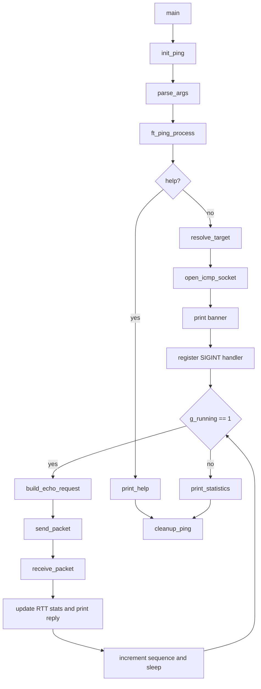

# ft_ping Technical Documentation

This document describes the implementation that exists in the current source
tree. It does not describe unimplemented `ping` behavior except in the
limitations and future work sections.

# Architecture

## High-Level Execution Flow



The program keeps all runtime state in one `t_ping` instance allocated on the
stack in `main()`. Modules receive a pointer to that state and update their
own part of the lifecycle.

## Lifecycle of a Ping Request

1. `build_echo_request()` writes an ICMP Echo Request into `ping->packet`.
2. `send_packet()` records `ping->send_time` and calls `sendto()`.
3. `ping->packets_transmitted` increments after `sendto()` succeeds.
4. `receive_packet()` blocks in `recvfrom()` until it sees a valid matching
   Echo Reply, an interrupt, or an error.
5. The receive path skips the IPv4 header and validates the ICMP header.
6. For a valid reply, the code records `recv_time`, computes RTT, extracts
   TTL, updates statistics, and prints one ping-style reply line.
7. The sequence number increments and the loop sleeps for one second.

# Source Tree Walkthrough

## `includes/ft_ping.h`

Purpose: shared project header.

Main contents:

- System includes required by networking, signals, time, and ICMP handling.
- `t_ping`, the central runtime state structure.
- `extern volatile sig_atomic_t g_running`.
- Function prototypes for every module.

Responsibilities:

- Defines the public interface between source files.
- Centralizes the state model used by parser, resolver, socket, packet,
  receive, statistics, and cleanup code.

Interactions:

- Included by every C source file.
- Includes `messages.h` so message constants are available everywhere.

## `includes/messages.h`

Purpose: centralizes user-facing text and simple constants.

Main contents:

- Help text.
- Error messages.
- Ping banner fragments.
- Payload size constant.
- Verbose ICMP error messages.

Responsibilities:

- Keeps output strings out of implementation logic.
- Provides `PING_PAYLOAD_SIZE`, currently `56`.

## `srcs/main.c`

Purpose: program entry point.

Main function:

```c
int	main(int argc, char **argv)
{
	t_ping	ping;
	int		status;

	init_ping(&ping);
	parse_args(argc, argv, &ping);
	status = ft_ping_process(&ping);
	cleanup_ping(&ping);
	return (status);
}
```

Responsibilities:

- Allocate the `t_ping` state on the stack.
- Initialize it.
- Parse arguments.
- Run the ping process.
- Cleanup before returning.

Interactions:

- Calls `init_ping()`, `parse_args()`, `ft_ping_process()`, and
  `cleanup_ping()`.

## `srcs/init.c`

Purpose: initializes all fields of `t_ping`.

Main function:

- `init_ping(t_ping *ping)`

Responsibilities:

- Sets pointers and strings to empty/null state.
- Sets `sockfd` to `-1`.
- Initializes packet and payload sizes.
- Starts sequence numbering at `1`.
- Initializes RTT and statistics counters to zero.
- Clears `verbose` and `help`.

Interactions:

- Called once from `main()` before parsing.

## `srcs/parser.c`

Purpose: command-line parsing.

Main functions:

- `parse_args()`
- `parse_option()`
- `parse_target()`
- `is_option()`

Responsibilities:

- Accepts one target argument.
- Accepts `-v` and `-?`.
- Rejects unknown options.
- Rejects multiple targets.
- Rejects missing targets unless help was requested.

Interactions:

- Sets `ping->target`, `ping->verbose`, and `ping->help`.
- Uses `exit_with_error()` for parser errors.

## `srcs/error.c`

Purpose: error and help output.

Main functions:

- `print_help()`
- `exit_with_error()`
- `handle_socket_error()`

Responsibilities:

- Writes help text to stdout.
- Writes errors to stderr.
- Runs cleanup before exiting on fatal errors.
- Converts raw socket permission failures (`EPERM`, `EACCES`) into a clearer
  user-facing message.

Interactions:

- Calls `cleanup_ping()` before `exit()`.
- Used by parser, resolver, process, and socket error paths.

## `srcs/cleanup.c`

Purpose: central cleanup path.

Main function:

- `cleanup_ping()`

Responsibilities:

- Calls `close_icmp_socket()`.

Interactions:

- Called from `main()` after normal processing.
- Called from `exit_with_error()` before fatal exit.

## `srcs/resolve_address.c`

Purpose: hostname or IPv4 address resolution.

Main functions:

- `resolve_target()`
- `copy_resolved_addr()`
- `fill_resolved_ip()`

Responsibilities:

- Uses `getaddrinfo()` with `hints.ai_family = AF_INET`.
- Copies the resolved `struct sockaddr_in` into `ping->dest_addr`.
- Sets `ping->dest_addr_len`.
- Converts the binary IPv4 address into `ping->resolved_ip` with
  `inet_ntop()`.
- Frees the `addrinfo` result before returning.

Interactions:

- Called by `ft_ping_process()` before opening the socket.
- Supplies the destination address used by `sendto()`.

## `srcs/socket.c`

Purpose: raw ICMP socket lifecycle.

Main functions:

- `open_icmp_socket()`
- `close_icmp_socket()`

Responsibilities:

- Opens a raw IPv4 ICMP socket:

```c
ping->sockfd = socket(AF_INET, SOCK_RAW, IPPROTO_ICMP);
```

- Closes the socket when `sockfd >= 0`.
- Resets `sockfd` to `-1`.

Interactions:

- `ft_ping_process()` opens the socket.
- `cleanup_ping()` closes it.

## `srcs/packet.c`

Purpose: ICMP Echo Request construction.

Main function:

- `build_echo_request(t_ping *ping, uint16_t sequence)`

Responsibilities:

- Validates that `payload_size <= PING_PAYLOAD_SIZE`.
- Sets `packet_size` to `ICMP_MINLEN + payload_size`.
- Zeroes the whole packet buffer.
- Treats the packet buffer as `struct icmp`.
- Sets:
  - `icmp_type = ICMP_ECHO`
  - `icmp_code = 0`
  - `icmp_id = htons((uint16_t)getpid() & 0xffff)`
  - `icmp_seq = htons(sequence)`
  - `icmp_cksum = 0`
- Computes and stores the checksum over the full packet.

Interactions:

- Called once per loop iteration by `ft_ping_process()`.
- Uses `icmp_checksum()` from `checksum.c`.

## `srcs/checksum.c`

Purpose: ICMP checksum calculation.

Main function:

- `icmp_checksum(void *data, size_t len)`

Responsibilities:

- Sums 16-bit words.
- Handles one trailing byte when the packet length is odd.
- Folds carries into 16 bits.
- Returns the one's-complement checksum.

Interactions:

- Called by `build_echo_request()`.

## `srcs/process.c`

Purpose: main ping process and loop orchestration.

Main functions:

- `ft_ping_process()`
- `send_packet()`
- `setup_sigint_handler()`
- `print_banner()`

Responsibilities:

- Handles help mode.
- Resolves target.
- Opens raw socket.
- Prints the initial `PING target (ip): 56 data bytes` banner.
- Registers the SIGINT handler.
- Runs the continuous ping loop while `g_running == 1`.
- Builds, sends, receives, counts, and sleeps between packets.
- Prints final statistics after loop exit.

Interactions:

- Calls resolver, socket, packet, receive, and statistics modules.

## `srcs/receive.c`

Purpose: packet reception, parsing, filtering, verbose ICMP messages, and
per-reply output.

Main functions:

- `receive_packet()`
- `skip_ip_header()`
- `validate_reply()`
- `set_reply_time()`
- `print_ping_reply()`
- `verbose_message()`
- `print_verbose_message()`

Responsibilities:

- Calls `recvfrom()` using `ping->sockfd`.
- Stores source address, source length, raw buffer, and received length.
- Parses the IPv4 header first.
- Locates the ICMP header after the IPv4 header.
- Ignores incomplete packets.
- In verbose mode, prints selected ICMP error packets and continues.
- Accepts Echo Replies only when id and sequence match the current request.
- Extracts TTL from the IPv4 header.
- Computes RTT.
- Updates RTT statistics.
- Prints the reply line.

Interactions:

- Called once per sent packet by `ft_ping_process()`.
- Calls `update_rtt_statistics()`.

## `srcs/statistics.c`

Purpose: RTT accumulation and final summary output.

Main functions:

- `update_rtt_statistics()`
- `print_statistics()`

Responsibilities:

- Increments `packets_received`.
- Maintains `rtt_min`, `rtt_max`, and `rtt_sum`.
- Computes average RTT at print time.
- Computes packet loss from transmitted and received counters.
- Prints final summary and RTT line when at least one reply was received.

Interactions:

- `receive_packet()` updates RTT statistics.
- `ft_ping_process()` prints final statistics after the loop.

## `srcs/signal.c`

Purpose: SIGINT handling.

Main contents:

```c
volatile sig_atomic_t	g_running = 1;
```

Main function:

- `handle_sigint(int sig)`

Responsibilities:

- Casts `sig` to void.
- Sets `g_running = 0`.

Interactions:

- Registered by `setup_sigint_handler()` in `process.c`.
- Read by the main loop and by the interrupted `recvfrom()` path.

## `linux.dockerfile`

Purpose: Debian-based development container.

Installed packages:

- `build-essential`
- `iputils-ping`
- `net-tools`
- `iproute2`
- `tcpdump`
- `gdb`
- `valgrind`

Responsibilities:

- Provides a Linux environment for build and raw-socket testing.

# Data Structures

## `t_ping`

`t_ping` owns all runtime state for one program execution. It is allocated on
the stack in `main()` and passed by pointer to every module.

| Field | Purpose | Ownership / Lifetime |
|---|---|---|
| `char *target` | Original destination argument, hostname or IPv4 string. | Points into `argv`; not allocated or freed by the program. |
| `char resolved_ip[INET_ADDRSTRLEN]` | Printable resolved IPv4 address. | Owned by `t_ping`; filled by `resolve_target()`. |
| `struct sockaddr_in dest_addr` | Binary destination address for `sendto()`. | Owned by `t_ping`; copied from `getaddrinfo()` result. |
| `socklen_t dest_addr_len` | Length of `dest_addr`. | Owned by `t_ping`; set during resolution. |
| `int sockfd` | Raw ICMP socket descriptor. | Opened by `open_icmp_socket()`, closed by cleanup. |
| `size_t payload_size` | Payload byte count. | Initialized to `PING_PAYLOAD_SIZE` (`56`). |
| `size_t packet_size` | ICMP packet size sent with `sendto()`. | Recomputed by `build_echo_request()`. |
| `unsigned char packet[...]` | Outgoing ICMP packet buffer. | Owned by `t_ping`; overwritten for each sequence. |
| `unsigned char recv_buffer[1500]` | Raw receive buffer. | Owned by `t_ping`; overwritten by `recvfrom()`. |
| `ssize_t recv_len` | Last received byte count. | Set by `receive_packet()`. |
| `struct sockaddr_in recv_addr` | Source address from last `recvfrom()`. | Set by `receive_packet()`. |
| `socklen_t recv_addr_len` | Length of receive address. | Set before and during `recvfrom()`. |
| `uint16_t sequence` | Current ICMP sequence number. | Starts at `1`; increments after a valid reply. |
| `struct timeval send_time` | Timestamp immediately before `sendto()`. | Set by `send_packet()`. |
| `struct timeval recv_time` | Timestamp after a valid Echo Reply is found. | Set by `receive_packet()`. |
| `double rtt_ms` | Last reply RTT in milliseconds. | Computed by `receive_packet()`. |
| `double rtt_min` | Minimum observed RTT. | Updated by `update_rtt_statistics()`. |
| `double rtt_max` | Maximum observed RTT. | Updated by `update_rtt_statistics()`. |
| `double rtt_sum` | Sum of RTTs for average calculation. | Updated by `update_rtt_statistics()`. |
| `size_t packets_transmitted` | Count of successful `sendto()` calls. | Incremented in `process.c`. |
| `size_t packets_received` | Count of valid matching Echo Replies. | Incremented by `update_rtt_statistics()`. |
| `int reply_ttl` | TTL from the received IPv4 header. | Set by `receive_packet()`. |
| `bool verbose` | Whether `-v` was requested. | Set by parser. |
| `bool help` | Whether `-?` was requested. | Set by parser. |

# Argument Parsing

`parse_args()` starts at `argv[1]` and processes every argument.

## Target Handling

The first non-option argument is stored in:

```c
ping->target = arg;
```

If another target appears, parsing exits with:

```text
ft_ping: too many arguments
```

## `-?`

`parse_option()` sets:

```c
ping->help = true;
```

`ft_ping_process()` checks `ping->help` before resolution or socket work.

## `-v`

`parse_option()` sets:

```c
ping->verbose = true;
```

Verbose mode affects only selected ICMP error packets in `receive_packet()`.

## Validation Rules

- Unknown options exit with `ft_ping: invalid option`.
- Missing target exits with `ft_ping: missing host operand`, unless help was
  requested.
- Options are accepted only as exact `-v` or `-?`.

## Error Handling

Parser errors call:

```c
exit_with_error(ping, ERR_..., EXIT_FAILURE);
```

That function runs cleanup, prints the message, and exits.

# Name Resolution

`resolve_target()` uses:

```c
memset(&hints, 0, sizeof(hints));
hints.ai_family = AF_INET;
status = getaddrinfo(ping->target, NULL, &hints, &res);
```

The resolver accepts both hostnames and numeric IPv4 addresses. It forces IPv4
by setting `AF_INET`.

The resolved address is copied into stable program state:

```c
addr = (struct sockaddr_in *)res->ai_addr;
ping->dest_addr = *addr;
ping->dest_addr_len = sizeof(ping->dest_addr);
```

The printable IP is generated with:

```c
inet_ntop(AF_INET, &ping->dest_addr.sin_addr,
	ping->resolved_ip, sizeof(ping->resolved_ip));
```

The temporary `addrinfo` list is freed before returning.

# Socket Layer

## Raw ICMP Socket

`open_icmp_socket()` opens:

```c
socket(AF_INET, SOCK_RAW, IPPROTO_ICMP);
```

The descriptor is stored in `ping->sockfd`.

If socket creation fails, `handle_socket_error()` reports permission failures
as:

```text
ft_ping: raw socket requires root privileges
```

## `sendto()` Usage

`send_packet()` sends the packet buffer to the resolved destination:

```c
sendto(ping->sockfd, ping->packet, ping->packet_size, 0,
	(struct sockaddr *)&ping->dest_addr, ping->dest_addr_len);
```

It records `send_time` immediately before the syscall.

## `recvfrom()` Usage

`receive_packet()` receives raw packets into `ping->recv_buffer`:

```c
recvfrom(ping->sockfd, ping->recv_buffer, sizeof(ping->recv_buffer), 0,
	(struct sockaddr *)&source_addr, &ping->recv_addr_len);
```

It stores:

- `ping->recv_len`
- `ping->recv_addr`
- `ping->recv_addr_len`

# Packet Construction

## ICMP Echo Request Format

The outgoing packet is:

```text
ICMP header, ICMP_MINLEN bytes
payload, ping->payload_size bytes
```

The buffer is zeroed before fields are written:

```c
memset(ping->packet, 0, sizeof(ping->packet));
```

## Identifier Generation

The ICMP identifier is derived from the process id:

```c
icmp->icmp_id = htons((uint16_t)getpid() & 0xffff);
```

This lets the receive path ignore Echo Replies intended for another process.

## Sequence Handling

`ping->sequence` starts at `1`.

Each request writes:

```c
icmp->icmp_seq = htons(sequence);
```

The sequence increments after a valid reply is received.

## Payload Handling

`payload_size` is initialized to `56`. The packet builder verifies that it does
not exceed the fixed buffer capacity. The payload bytes are zero because the
whole packet buffer is cleared before the ICMP header is filled.

# Checksum

ICMP requires a checksum over the full ICMP message. The implementation:

1. Sets `icmp_cksum` to `0`.
2. Sums 16-bit words.
3. Adds a trailing byte if the length is odd.
4. Folds high 16 bits into low 16 bits.
5. Returns the one's complement.

The result is written back into:

```c
icmp->icmp_cksum
```

# Receive Path

Raw ICMP sockets receive an IPv4 header before the ICMP message.

## IPv4 Header Parsing

`skip_ip_header()` starts by treating the receive buffer as `struct ip`:

```c
ip_hdr = (struct ip *)buffer;
ip_len = ip_hdr->ip_hl << 2;
```

It rejects packets when:

- the receive length is smaller than `sizeof(struct ip)`
- the computed IP header length is smaller than `sizeof(struct ip)`
- the packet does not contain at least `ICMP_MINLEN` bytes after the IP header

## ICMP Header Parsing

The ICMP pointer is:

```c
return ((struct icmp *)(buffer + ip_len));
```

## Echo Reply Validation

`validate_reply()` accepts only:

- `icmp_type == ICMP_ECHOREPLY`
- `icmp_id == getpid() & 0xffff`
- `icmp_seq == ping->sequence`

All other packets are ignored in normal mode.

## Packet Filtering

Packets with invalid structure are ignored. Echo Replies for other processes
or other sequence numbers are ignored. In verbose mode, selected error packets
are printed and then ignored for success/statistics purposes.

# Verbose Mode

Verbose mode is enabled by `-v`.

When enabled, `receive_packet()` prints concise messages for:

| ICMP type in code | Message |
|---|---|
| `ICMP_TIMXCEED` | `Time to live exceeded` |
| `ICMP_UNREACH` | `Destination unreachable` |
| `ICMP_REDIRECT` | `Redirect` |
| `ICMP_PARAMPROB` | `Parameter problem` |

These messages are printed as:

```text
<bytes> bytes from <source-ip>: <message>
```

Verbose packets do not:

- increment `packets_received`
- update RTT statistics
- stop the program

The receive loop continues waiting for a valid Echo Reply.

# RTT Calculation

`send_packet()` records:

```c
gettimeofday(&ping->send_time, NULL);
```

After a valid matching reply, `receive_packet()` records:

```c
gettimeofday(&ping->recv_time, NULL);
```

RTT is computed in milliseconds:

```c
ping->rtt_ms = (ping->recv_time.tv_sec - ping->send_time.tv_sec) * 1000.0;
ping->rtt_ms += (ping->recv_time.tv_usec - ping->send_time.tv_usec)
	/ 1000.0;
```

The reply TTL is extracted from the received IPv4 header:

```c
ping->reply_ttl = ip_hdr->ip_ttl;
```

# Statistics

## Transmitted Count

`packets_transmitted` increments only after `sendto()` succeeds.

## Received Count

`packets_received` increments only in `update_rtt_statistics()`, which is
called after a valid matching Echo Reply is accepted.

## Packet Loss

`print_statistics()` computes:

```text
(packets_transmitted - packets_received) * 100 / packets_transmitted
```

If no packets were transmitted, loss is printed as `0%` to avoid division by
zero.

## RTT Min / Avg / Max

For the first received packet, min and max are both set to that packet's RTT.
Subsequent replies update min and max when appropriate.

Average is computed at print time:

```text
rtt_sum / packets_received
```

The RTT summary is printed only if at least one Echo Reply was received.

# Signal Handling

The global running flag is:

```c
volatile sig_atomic_t	g_running = 1;
```

The SIGINT handler is signal-safe:

```c
void	handle_sigint(int sig)
{
	(void)sig;
	g_running = 0;
}
```

`setup_sigint_handler()` registers it with `sigaction()` before the ping loop.

When `Ctrl+C` is pressed:

1. `g_running` becomes `0`.
2. An interrupted `recvfrom()` returns cleanly when `errno == EINTR`.
3. The process loop breaks.
4. `print_statistics()` runs.
5. `main()` calls `cleanup_ping()`.

# Current Limitations

- No receive timeout is implemented. A lost packet can block `recvfrom()`
  until a packet arrives or SIGINT interrupts it.
- Packet loss is based only on successful sends versus valid replies observed
  before shutdown; unanswered packets are not timed out.
- Sequence numbers increment only after a valid reply, not immediately after a
  send.
- The implementation uses BSD-style ICMP names such as `struct icmp`,
  `ICMP_TIMXCEED`, and `ICMP_PARAMPROB`; Debian/Linux compatibility must be
  verified in the provided container.
- Verbose mode handles only four ICMP error categories and does not decode
  subcodes.
- No duplicate detection.
- No configurable payload size, interval, timeout, TTL, or packet count.
- No IPv6 support.
- No advanced inetutils/GNU formatting parity.
- No automated integration tests are currently included.

# Future Work

- Add socket receive timeouts and count timed-out probes as loss.
- Verify and adjust ICMP type names for Debian/Linux headers.
- Increment sequence after successful send and track outstanding requests.
- Add duplicate Echo Reply detection.
- Decode ICMP error subcodes in verbose mode.
- Add optional packet count, interval, TTL, and payload size controls.
- Add Docker-based integration tests that run with `NET_RAW` capability.
- Compare output manually against inetutils `ping` for final polish.
